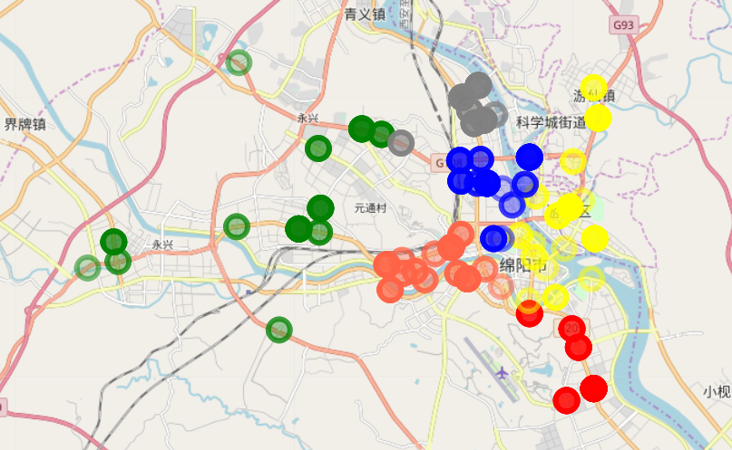
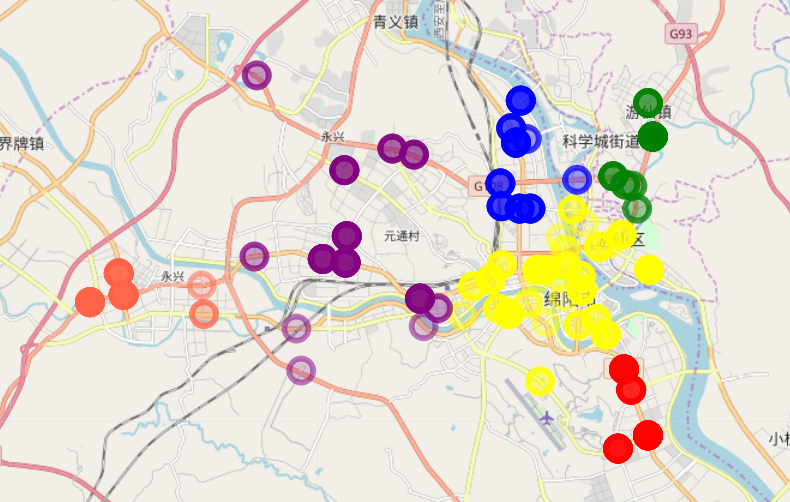
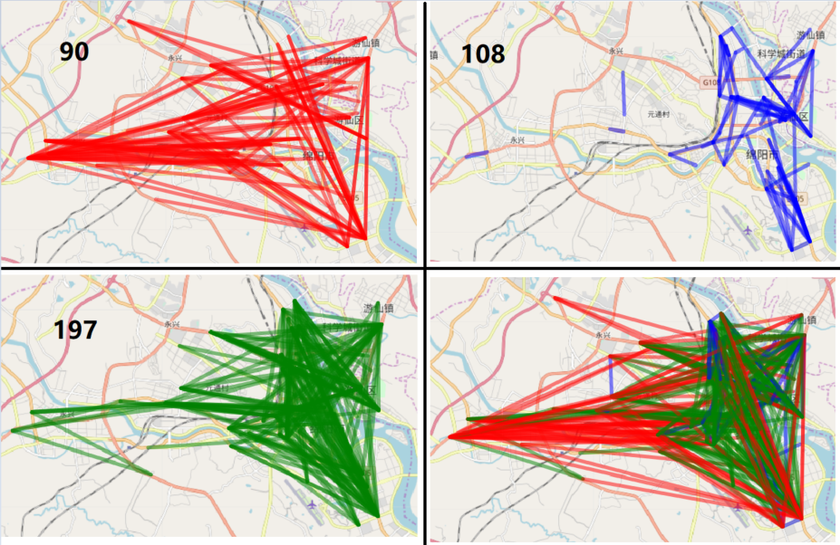

# OD聚类

**计算机学院**

**组员：严喆  3190602013**

## 1.数据分析

数据集为395例，包含起点经纬度，终点经纬度等

分别对起点，终点和OD线进行聚类

首先使用***leaflet***包将起点终点及OD线绘制在地图上，观察数据分布

- 起点

  

  

- 终点

  

- OD线

  


## 2. 起点，终点聚类

使用PAM算法依据坐标点对起点和终点进行聚类

```R
library(cluster)

# 读取数据
data_s = read.csv("df3.csv")

data_start = data_s[,5:6]
data_end = data_s[,7:8]

df_start = data.frame(latitude = data_start[,2], longitude=data_start[,1])
df_end = data.frame(latitude = data_end[,2], longitude=data_end[,1])

# 对起点和终点分别聚类
start.pam <- pam(data_start, 6)
end.pam <- pam(data_end, 6)
```

- 起点聚类图

  

  ### 结果分析

  使用PAM算法将起点聚为6个簇。

  根据聚类结果， 除**<font color='green'>绿色</font>**簇簇内各点较分散外，其余各簇内部各点均很紧密，且簇间边界明显


- 终点聚类图

  

  ### 结果分析

  使用PAM算法将终点聚为6个簇。

  根据聚类结果， 除**<font color='purple'>紫色</font>**簇簇内各点较分散外，其余各簇内部各点均很紧密，且簇间边界明显

## 3. OD线聚类

聚类思想：采用起点和终点之间的欧氏距离作为度量， 使用PAM算法对该距离值聚类

按距离的近，中，远将OD线聚为3个簇

```R
# OD线聚类

# 计算欧氏距离
OD = df_end - df_start
OD$dist = sqrt(OD$latitude^2 + OD$longitude^2)
# 聚类
OD_pam <- pam(OD$dist, 3)
```


- OD线聚类图

  

  ### 结果分析

  **<font color='red'>红色</font>**线为距离较远的样本（90例）

  **<font color='blue'>蓝色</font>**线为距离较近的样本（108例）

  **<font color='green'>绿色</font>**线为距离适中的样本（197例）

  中等距离的样本数明显多于较近和较远的

  ### 思考

  OD线还可以通过计算两个向量之间的相似度（例如余弦相似度）来实现将方向相似的OD线聚为同一个簇

  